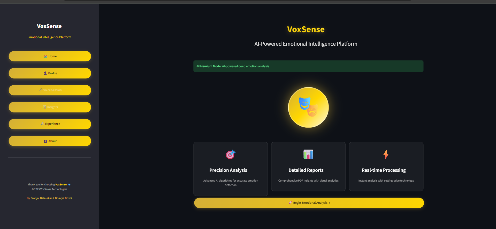
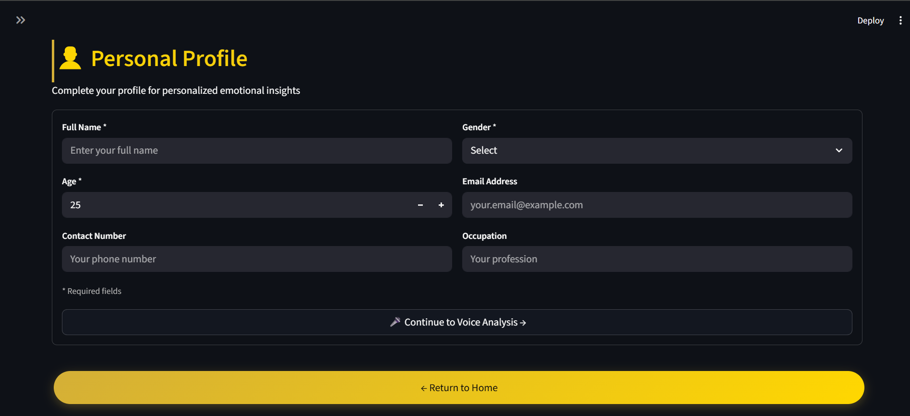
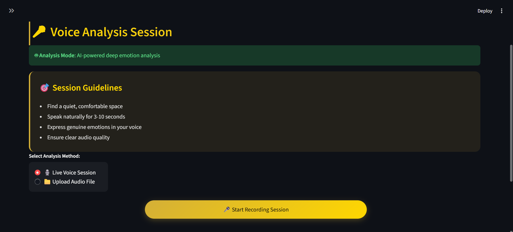
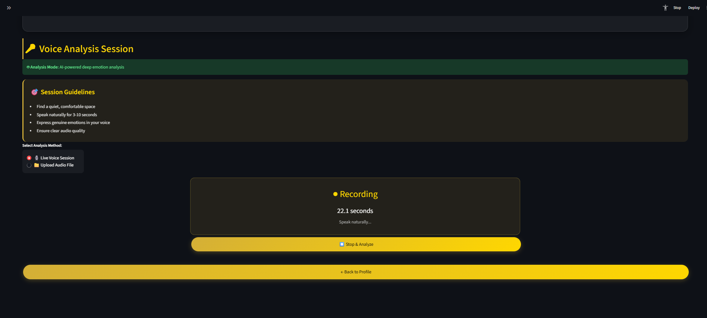
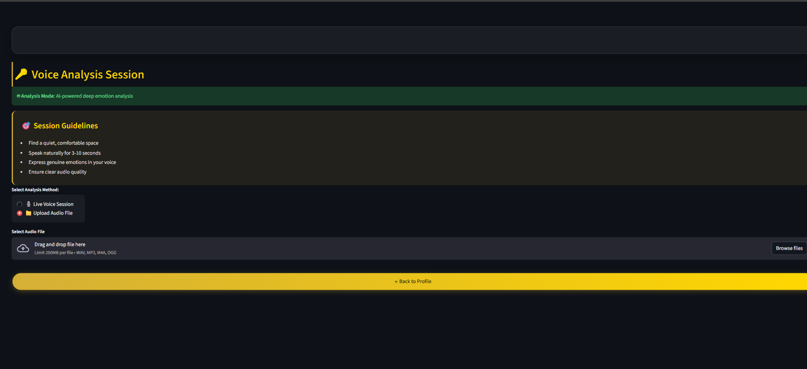
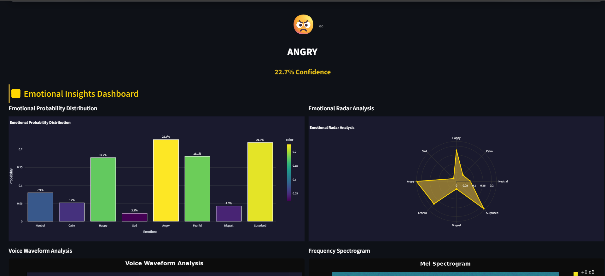
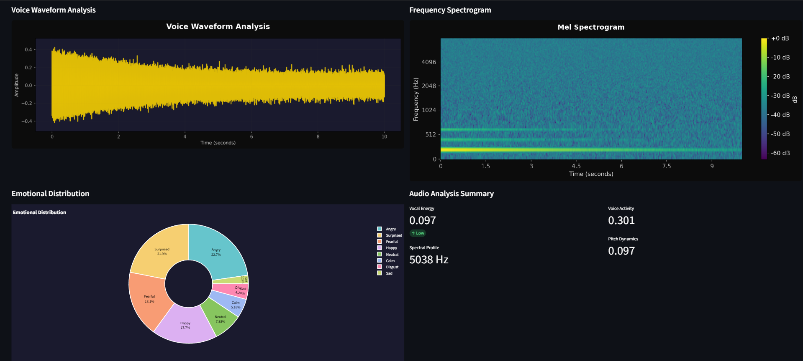
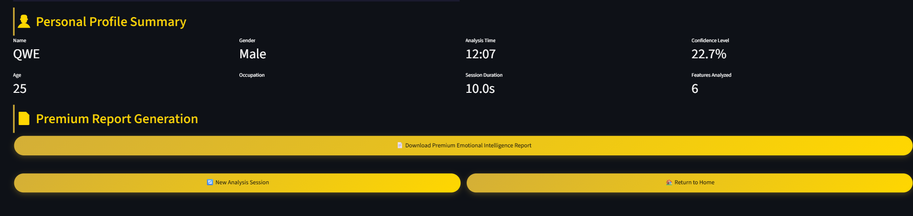

# VoxSense 🎭: AI-Powered Emotion Recognition from Voice

[](https://www.python.org/downloads/)
[](https://streamlit.io)
[](https://pytorch.org/)
[](https://opensource.org/licenses/MIT)

**VoxSense** is a sophisticated, AI-driven platform that analyzes vocal patterns to detect human emotions. It provides real-time emotional intelligence through a premium, user-friendly web interface, complete with detailed visualizations and downloadable reports.

---

<p align="center">
  
</p>

## 🎥 Project Demo

> A complete walkthrough of VoxSense's features, from voice analysis to report generation.
 
**▶ Click to play the demo video:**

https://github.com/bhavyadoshi12/VoxSense_ER/raw/main/assets/video/VoxSense_ER.mp4

---

## 🖥️ Application UI

<details>
<summary><b>📸 Click to view application screenshots</b></summary>


### 🏠 Home Page
  
**Description:** The landing page of VoxSense, providing navigation options and an overview of the system.

### 👤 Personal Profile
  
**Description:** User profile page where personal details and preferences are displayed or updated.

### 🎤 Voice Analysis
  
**Description:** Interface for analyzing uploaded or recorded voice samples to detect emotional states.

### 🔴 Live Voice Session
 
**Description:** Real-time voice recording and emotion detection session for live analysis.

### ⬆️ Upload Session

**Description:** Page for uploading pre-recorded audio files for emotion recognition processing.

### 📊 Dashboard 

**Description:** Visual representation of emotion analysis results with charts and graphs.

### 📈 Dashboard 2
 
**Description:** Additional analytics dashboard showing detailed metrics and comparisons.

### 📉 Dashboard 3
  
**Description:** Summary dashboard with tabular data and performance indicators.


</details>

---

## ✨ Key Features

- **🧠 Dual Analysis Modes**:
  - **🤖 AI-Powered Deep Analysis**: Utilizes a PyTorch-based deep learning model for high-accuracy emotion prediction.
  - **🔧 Enhanced Rule-Based Analysis**: A robust fallback system for environments without PyTorch.
- **🎙️ Flexible Audio Input**:
  - **Live Voice Session**: Record your voice directly in the browser.
  - **File Upload**: Analyze pre-recorded audio files (`.wav`, `.mp3`, `.m4a`, `.ogg`).
- **📊 Comprehensive Insights Dashboard**:
  - **Emotion Probability Charts**: Bar, Radar, and Pie charts for a clear view of the emotional distribution.
  - **Vocal Analysis**: Visualize the audio waveform and frequency spectrogram.
  - **Acoustic Metrics**: Detailed metrics on vocal energy, pitch dynamics, and more.
- **👤 Personalized Experience**:
  - User profiles for tailored insights and report generation.
- **📄 Premium PDF Reports**:
  - Dynamically generate and download a detailed Emotional Intelligence Report summarizing the analysis.
- **🎨 Premium UI/UX**:
  - A sleek, modern interface with gradient effects, glassmorphism cards, and smooth animations.

---

## 🛠️ Technology Stack

- **Backend**: Python
- **Web Framework**: Streamlit
- **AI/ML**: PyTorch, Librosa, Scikit-learn
- **Data Processing**: NumPy, Pandas
- **Visualization**: Plotly, Matplotlib
- **PDF Generation**: ReportLab
- **Audio Handling**: SoundFile, PyDub

---

## ⚙️ Setup and Installation

Follow these steps to get the project up and running on your local machine.

### 1. Clone the Repository

```bash
git clone https://github.com/bhavyadoshi12/VoxSense_ER.git
cd VoxSense_ER
```

### 2. Create and Activate a Virtual Environment

It's highly recommended to use a virtual environment to manage project dependencies.

```bash
# Create the virtual environment
python -m venv venv

# Activate the environment
# On Windows:
venv\Scripts\activate

# On macOS/Linux:
source venv/bin/activate
```

### 3. Install Dependencies

You can install all the required packages by running the provided script. This ensures that all version compatibilities are met.

```bash
python install_dependencies.py
```

This script will install all the necessary libraries listed in `install_dependencies.py`.

### 4. Pre-trained Models

The project is designed to work with pre-trained models located in the `assets/models/` directory.
- `best_emotion_model.pth`: The primary model for audio feature-based emotion recognition.
- `cnn_emotion_model.pth`: An optional model for image-based emotion recognition.

You can train your own models using the provided training scripts (`train_emotion_model.py`, `train_cnn_emotion.py`).

---

## 🚀 How to Run the Project

Once the setup is complete, you can start the application using Streamlit.

Make sure your virtual environment is activated.

```bash
streamlit run main.py
```

This command will launch the VoxSense application in your default web browser.

---

## 🤝 Contributing

We welcome all contributions! The project is open to any developer who wants to help. A key area for improvement is increasing the model's prediction confidence, which can sometimes be around 30%. If you have ideas for improving the model or adding new features, please feel free to open an issue or submit a pull request.

1.  Fork the Project
2.  Create your Feature Branch (`git checkout -b feature/AmazingFeature`)
3.  Commit your Changes (`git commit -m 'Add some AmazingFeature'`)
4.  Push to the Branch (`git push origin feature/AmazingFeature`)
5.  Open a Pull Request

---

## ✍️ Authors

This project was crafted with excellence by:

- **Pranjal Belalekar**
- **Bhavya Doshi**

---

## 📄 License

This project is distributed under the MIT License. See `LICENSE` for more information.

---

*Thank you for exploring VoxSense!* 💎
