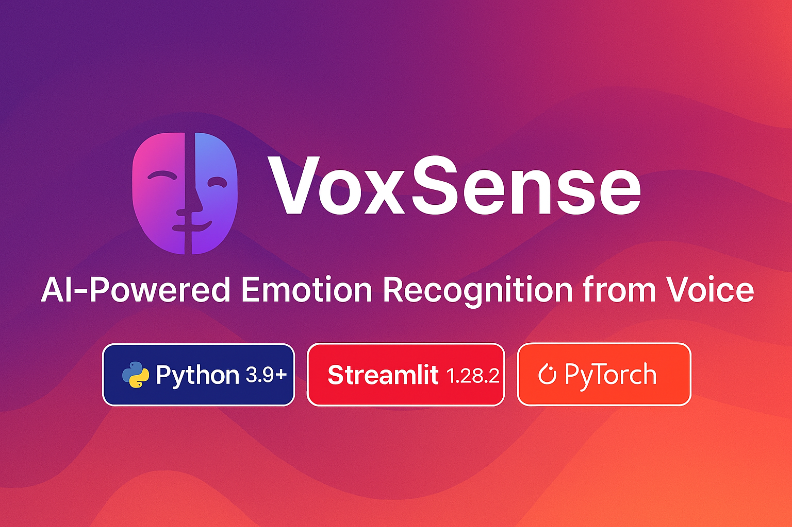
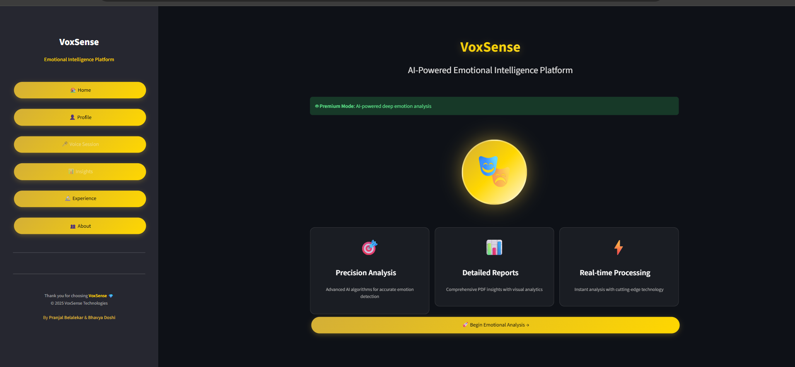
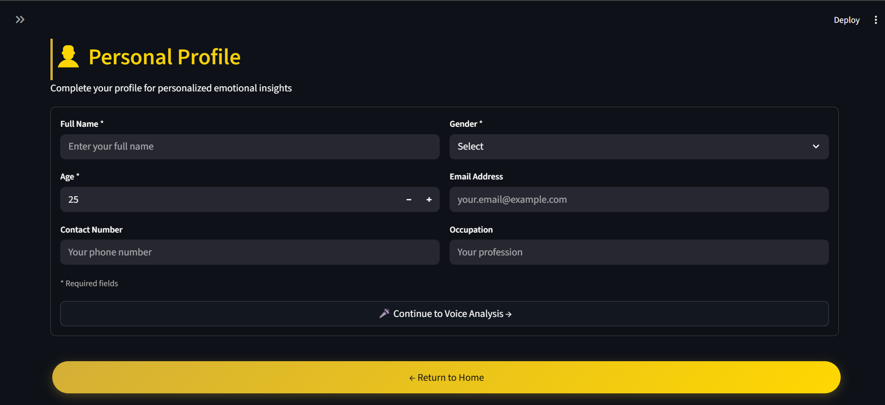
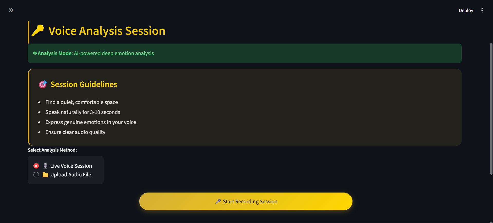
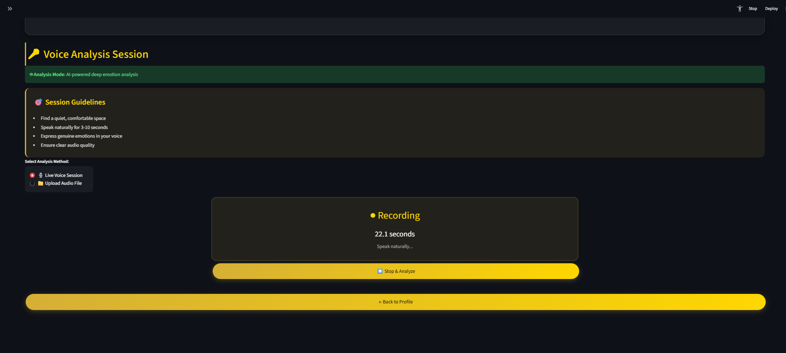
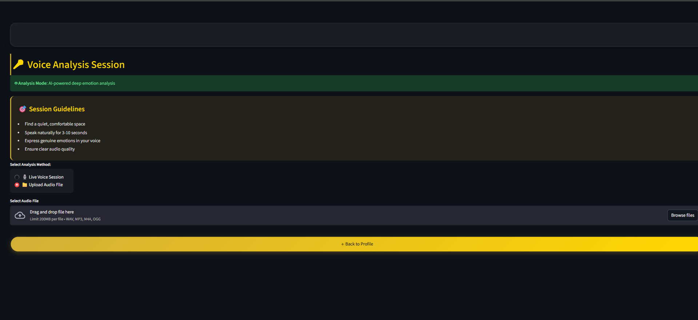
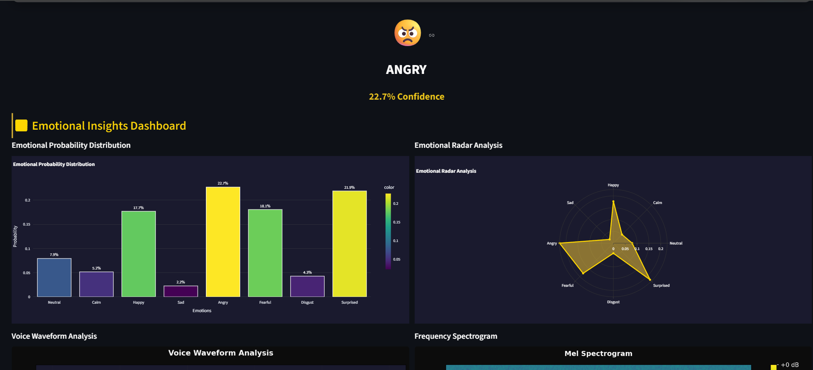
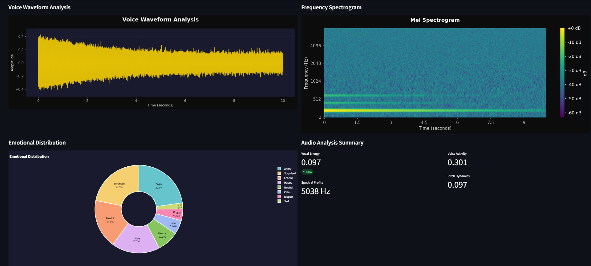
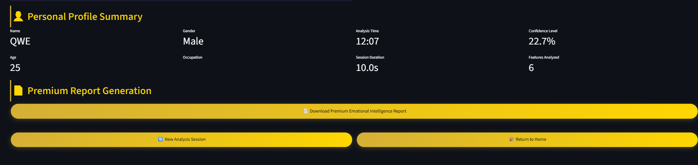

# 🎭 VoxSense-ER — AI-Powered Emotion Recognition from Voice

<p align="center">
  
</p>

<p align="center">
  <b>An AI-driven platform that analyzes human voice to detect emotions in real time</b>
</p>

<p align="center">
  
  
  
  
</p>

---

## 🌐 Live Demo

🔗 **https://voxsense-er.streamlit.app/**  
*Deployed on Streamlit Cloud*

---

## 📖 Overview

**VoxSense-ER** is an advanced **AI-powered emotion recognition system** that analyzes vocal characteristics to identify human emotional states.

The platform provides **real-time emotion detection**, **interactive dashboards**, and **professional downloadable reports**, making it suitable for:

- Call-center intelligence  
- Mental health analysis  
- HR & interview evaluation  
- Human–Computer Interaction research  
- Speech emotion recognition studies  

---

## 🎥 Project Demo

▶ **Demo Video:**  
https://github.com/bhavyadoshi12/VoxSense_ER/raw/main/assets/video/VoxSense_ER.mp4

---

## 🖥️ Application Preview

<p align="center">
  
</p>

<details>
<summary><b>📸 View Full Application UI</b></summary>

### 🏠 Home Page


### 👤 Personal Profile


### 🎤 Voice Analysis


### 🔴 Live Voice Session


### ⬆️ Upload Session


### 📊 Dashboard


### 📈 Advanced Analytics


### 📉 Summary View


</details>

---

## ✨ Key Features

### 🧠 Emotion Intelligence Engine
- Deep learning–based emotion recognition using PyTorch
- Rule-based fallback emotion detection
- Multi-emotion probability prediction

### 🎙️ Audio Input Modes
- Live voice recording from browser
- Audio file upload (`.wav`, `.mp3`, `.m4a`, `.ogg`)

### 📊 Analytics & Visualization
- Emotion probability charts (Bar, Pie, Radar)
- Audio waveform & spectrogram analysis
- Pitch, energy & frequency metrics

### 📄 Reports
- Downloadable **PDF Emotional Intelligence Reports**
- Visual and statistical summaries

### 🎨 UI/UX
- Modern Streamlit interface
- Responsive design
- Smooth animations and premium layout

---

## 🛠️ Technology Stack

| Layer | Technologies |
|------|-------------|
| Backend | Python |
| Web Framework | Streamlit |
| AI / ML | PyTorch, Librosa, Scikit-learn |
| Data Processing | NumPy, Pandas |
| Visualization | Plotly, Matplotlib |
| Audio Processing | SoundFile, PyDub |
| Reporting | ReportLab |

---

## ⚙️ Setup & Installation

### 1️⃣ Clone Repository
```bash
git clone https://github.com/bhavyadoshi12/VoxSense_ER.git
cd VoxSense_ER
````

### 2️⃣ Create Virtual Environment

```bash
python -m venv venv
```

**Activate**

**Windows**

```bash
venv\Scripts\activate
```

**macOS / Linux**

```bash
source venv/bin/activate
```

### 3️⃣ Install Dependencies

```bash
python install_dependencies.py
```

---

## 🧠 Pre-trained Models

Location: `assets/models/`

* `best_emotion_model.pth` — Primary audio-based emotion model
* `cnn_emotion_model.pth` — Optional CNN model

Training scripts:

* `train_emotion_model.py`
* `train_cnn_emotion.py`

---

## 🚀 Run the Application

```bash
streamlit run main.py
```

The application will launch in your default browser.

---

## 🤝 Contributing

Contributions are welcome.

**Known Improvement Area:**
Emotion confidence may occasionally be low (~30%).
Model optimization and dataset improvements are encouraged.

Steps:

1. Fork the repository
2. Create a feature branch

   ```bash
   git checkout -b feature/YourFeature
   ```
3. Commit changes

   ```bash
   git commit -m "Add YourFeature"
   ```
4. Push and open a Pull Request

---

## ✍️ Authors

* **Pranjal Belalekar**
* **Bhavya Doshi**

---

## 📄 License

This project is licensed under the **MIT License**.
See the `LICENSE` file for more details.

---

<p align="center">
  <b>Turning voices into emotional intelligence.</b>
</p>

